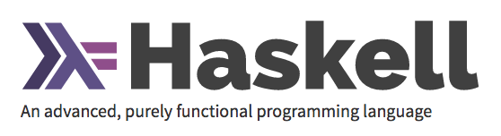
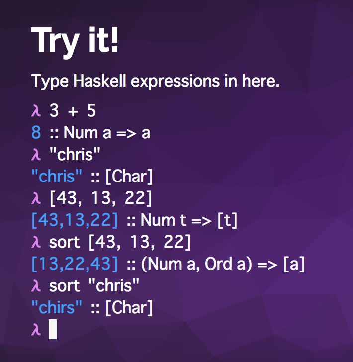
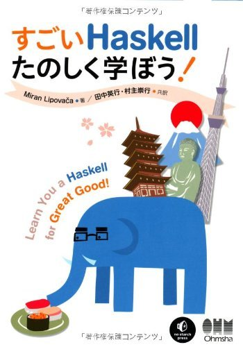
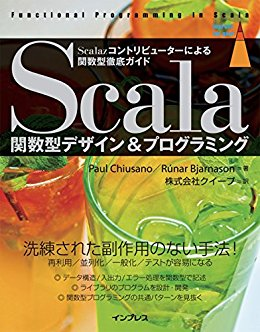

# はじめる関数型プログラミング
## - Haskellではじめよう -
##### 株式会社VOYAGE GROUP
##### 泉雅彦 @mizmarine

---

# who are you?


- 泉 雅彦@mizmarine
- 株式会社VOYAGE GROUP
  - そろそろ2年目終わります
  - Pythonで広告配信書いてます
- Like
  - :computer: Python / Haskell
  - :book: ミステリ
  - :runner: 脱出ゲーム

---

# agenda

- 関数型プログラミングとは
- Haskell入門
- 高階関数を用いた抽象化

---

# 関数型プログラミングとは

---

# 関数型プログラミングとは

- プログラミングパラダイムの１つ
  - パラダイム: 考え方.捉え方
  - ex.手続き型/オブジェクト指向/etc..
- 書き方が異なるだけ
- 異なるパラダイムを学び，応用できるところは活かしていこう

---

# 関数型プログラミングとは

- 関数型プログラミング
  - 「純粋関数」をベースとしたプログラミングのこと
- 小さな「関数」をパーツとし，組み合わせて様々な処理を作る
  - linuxコマンドをイメージしてください


---

# 関数型プログラミングとは

- 例: テキストファイル中，「#」から始まるデータを取得する

```
cat slide.md | grep -e '^#' | sort | head -n 3
# Features
# Haskellとは
# Haskell入門
```

- 手続き型の場合，arrayにしてifで場合分けして...みたいな感じで書くことになるかな

---

# 何が嬉しいの？

- 1つ１つのパーツ（関数）がコンパクトになる
  - テスト性，メンテナンス性が上がる
- 再利用性も高い
  - ex. grepした後にsedで変換しよう
- ではそもそも「関数」とはなにか？

---

# 関数

- 「値を渡したら」「何か返ってくる処理」のこと

```python
# addOneは 受け取った数に1を足して返す関数
In [1]: def addOne(x):
   ...:     return x + 1
   ...:

In [2]: addOne(1)
Out[2]: 2

In [3]: addOne(3)
Out[3]: 4
```

---

# 関数

```python
# 関数型プログラミングの世界において，返り値がないものは関数ではない
In [1]: def greeting(name):
   ...:     print 'hello,' + name
   ...:

In [2]: result = greeting('izumi')
hello,izumi

In [3]: print result
None
```

---

# 副作用

- 関数呼び出し前後で 状態を書き換えること
- ex
  - オブジェクトの状態更新
  - DBへの書き込み

---

# 例: オブジェクトの状態更新

```python
In [1]: class User(object):
  ...:     def __init__(self, name):
  ...:         self.name = name

In [2]: def rename(user, new_name):
  ...:     user.name = new_name

In [3]: u = User('izumi')

In [4]: u.name
Out[4]: 'izumi'

In [5]: rename(u, 'masahiko')

In [6]: u.name
Out[6]: 'masahiko'  # 状態が書き換わっている！
```

---

# 純粋関数

- 副作用がない関数のこと
  - 数学における関数と同じもの
- 何が嬉しい？
  - 同じ引数なら，いつでも同じ値を返す（参照透過性）
  - 同じ式は置換可能なので，等価性推論が容易

---

# ここまでのまとめ

- 関数型プログラミング
  - 純粋関数を組み合わせて処理を記述するスタイルのこと
- 純粋関数
  - 副作用のない関数
- 何が嬉しい？
  - メンテナンス性，再利用性が高い

---

# Haskell入門

---




---

# Haskellとは

> An advanced, purely functional programming language
-- https://www.haskell.org

---

# Features

- Statically typed
- **Purely** functional
- Type interface
- Concurrent
- Lazy
- Packages


---

# how to isntall

- macの場合

```
brew cask install haskell-platform
```

- 他は公式サイトで調べてどうぞ
  - https://www.haskell.org/downloads
- 公式サイト上オンラインでも試せます




---

# 数値計算

```haskell
-- 演算子は優先度あり
Prelude> 3 + 5
8
Prelude> 50 * 100 - 4999
1
Prelude> 100 - 10 * 9
10

-- 負値は注意
Prelude> 5 * -3

interactive:4:1: error:
    Precedence parsing error
        cannot mix ‘*’ [infixl 7] and prefix `-' [infixl 6] in the same infix expression
Prelude> 5 * (-3)
-15
```

---

# 論理演算

```haskell
-- 論理演算
Prelude> True && True
True
Prelude> True && False
False
Prelude> True || False
True
Prelude> not True
False

-- 比較演算
Prelude> 1 == 1
True
Prelude> 1 /= 1 -- not equal
False
```

---

# リテラル

```haskell
-- 文字
Prelude> 'a'
'a'

-- 文字列
Prelude> "hoge"
"hoge"

-- リスト
Prelude> [1,2,3]
[1,2,3]

-- 文字列は文字リストのsyntax sugar
Prelude> "masa" == ['m', 'a', 's', 'a']
True
```

---

# 関数呼び出し: succ

```haskell
-- 関数名のあと空白おくと関数適用になる
-- succ: 1引数をうけて，「次に続くもの」を返す
Prelude> succ 1
2
-- succ(1) とは書かない！

-- 文字の場合はアルファベット順
Prelude> succ 'a'
'b'

-- 「次に続くもの」が明確でない場合，error
Prelude> succ "masa"

interactive:33:1: error:
    • No instance for (Enum [Char]) arising from a use of ‘succ’
    • In the expression: succ "masa"
      In an equation for ‘it’: it = succ "masa"
```

---

# 関数呼び出し: toUpper

```haskell
-- 外部モジュールのコードはimportして利用できる
Prelude> import Data.Char
Prelude Data.Char> toUpper 'a'
'A'
-- toUpper('a') とは書かない!
```


---

# 関数呼び出し: max

```haskell
-- max: 2引数を受け，大きい方を返す
Prelude> max 3 5
5
-- max(3,5) とは書かない！

Prelude> max 'a' 'b'
'b'

-- listの場合，先頭から比較していく
Prelude> max [1,2,3] [2,1]
[2,1]
Prelude> max "hoge" "huga"
"huga"
```

---

# 型の確認

```haskell
-- :type x もしくは :t x で xの型を調べられる
Prelude> :type 'a'
'a' :: Char
Prelude> :t "masa"
"masa" :: [Char]

-- 関数の型をみることもできる
Prelude> import Data.Char
Prelude Data.Char> :t toUpper
toUpper :: Char -> Char  -- Char型を受けてChar型を返す関数
```

---

# 関数定義

```haskell
-- sample.hsとして定義
doubleMe :: Int -> Int
doubleMe x = x * 2
```

```haskell
-- ghciから読み込み
Prelude> :l sample.hs
[1 of 1] Compiling Main             ( sample.hs, interpreted )
Ok, modules loaded: Main.
*Main> doubleMe 3
6
```

---

# 関数定義の便利構文

- 場合分け
  - パターンマッチ
  - ガード
- 関数定義
  - 関数合成
  - カリー化
  - 型クラス

---

# パターンマッチ

- マッチしたケースにあわせて処理を行う
  - イメージはこれ

$$
f(x) = \left\{
\begin{array}{ll}
100 & (x = 1) \\
50 & (x = 0) \\
0 & (otherwise)
\end{array}
\right.
$$

---

# パターンマッチ

```haskell
weekday :: Int -> String
weekday 0 = "Sunday"
weekday 1 = "Monday"
weekday 2 = "Tuesday"
weekday 3 = "Wednesday"
weekday 4 = "Thursday"
weekday 5 = "Friday"
weekday 6 = "Saturday"
weekday otherwise = "unknown"
```

---

# パターンマッチ

```haskell
Prelude> :l sample.hs
[1 of 1] Compiling Main             ( sample.hs, interpreted )
Ok, modules loaded: Main.
*Main> weekday 0
"Sunday"
*Main> weekday 4
"Thursday"
*Main> weekday 7
"unknown"
```

---

# ガード

- マッチした引数の条件分けができる
  - イメージはこれ

$$
g(x) = \left\{
\begin{array}{ll}
2x & (x \geq 1) \\
x & (1 \gt x \geq 0) \\
0 & (otherwise)
\end{array}
\right.
$$

---

# ガード
```haskell
scoreCheck :: Int -> String
scoreCheck x
  | x == 100 = "Excellent!!"
  | x > 90 = "very good!"
  | x > 80 = "good."
  | x > 70 = "so so."
  | otherwise = "do your best ><"
```

---

# ガード

```haskell
Prelude> :l sample.hs
[1 of 1] Compiling Main             ( sample.hs, interpreted )
Ok, modules loaded: Main.
*Main> scoreCheck 100
"Excellent!!"
*Main> scoreCheck 85
"good."
*Main> scoreCheck 59
"do your best ><"
```

---

# 型クラス

- 同じような処理の関数も，型が違ったら適用できない

```haskell
equalInt :: Int -> Int -> Bool
equalInt x y = x == y

*Main> equalInt 1 1
True

*Main> equalInt 'a' 'b'
interactive:4:10: error:
    • Couldn't match expected type ‘Int’ with actual type ‘Char’
    • In the first argument of ‘equalInt’, namely ‘'a'’
      In the expression: equalInt 'a' 'b'
      In an equation for ‘it’: it = equalInt 'a' 'b'
```

---

# 型クラス

- 具体的な型(Int, Char,..)が どのような性質をもつか，を示すもの
  - 同値比較ができるか，順序比較ができるか..など
  - java や golang における interface に近い
- ex. Eq型クラス
  - `==` 演算子で比較演算ができるか
  - Int, Charは `1 == 1`, `'a' == 'b'` という比較演算ができる
  - Int, Char は Eq型クラスに属する，という

---

# 型クラス

- equalIntを Eq型クラスに対する関数として定義

```haskell
equalEq :: (Eq a) => a -> a -> Bool
equalEq x y = x == y

*Main> equalEq 1 1
True
*Main> equalEq 'a' 'b'
False
```

---

# その他型クラスの例

- Ord型クラス
  - 順序比較計算( `>` )ができるもの
- Enum型クラス
  - 値を列挙できるもの
- Num型クラス
  - 数値演算( `+`, `*`, etc..)ができるもの

---

# ここまでのまとめ

- 基本構文
  - 数値, 真偽値, 文字列, リスト
  - 関数定義
- 便利構文
  - パターンマッチ
  - ガード
- 型クラス

---

# 高階関数

---

# 高階関数

- 関数自体を値として利用する関数のこと
  - map
  - filter
  - fold

---

# 参考資料



^ すごいHaskellたのしく学ぼう！
^ Scala関数型デザイン&プログラミング


