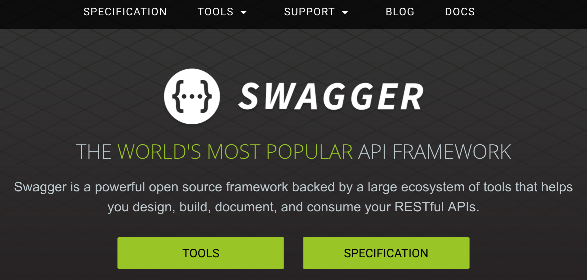
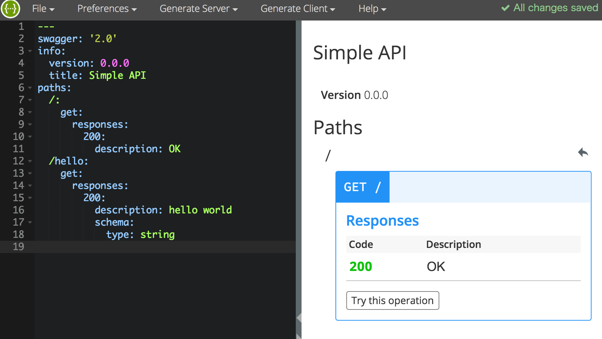
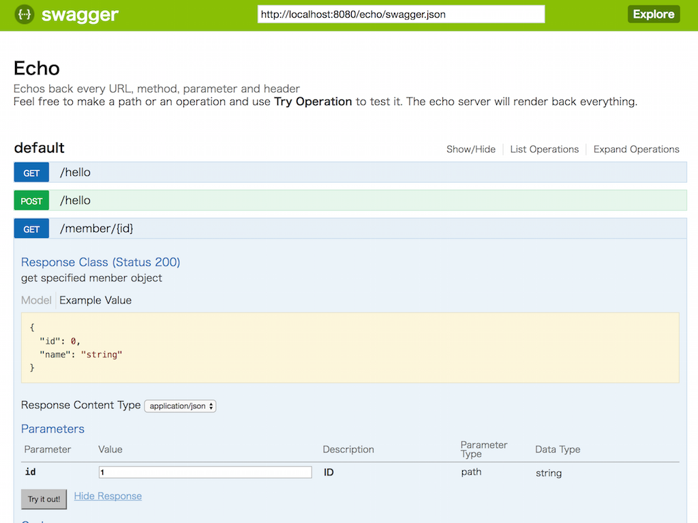

<!-- $theme: default -->

## Swaggerではじめる デザインファーストAPI開発


### 株式会社fluct
### 泉 雅彦

---

# who are you ?

- 泉 雅彦(@mizmarine)
- 株式会社fluct
	- 広告配信サーバを Pythonで 書いてます
	- そろそろ2年目が終わります
- 最近 関数型プログラミングが面白いなーと勉強中
	- Haskell / Scala あたり興味あります

---

# TL;DR

- 最近 swagger * connexion 使ってAPI開発してます
	- swagger : api仕様をyamlで記述できるやつ（雑
- メリット・デメリット見えてきたのでお話します

---

# API開発よくある話


- 初期設計
	- 一通り頑張ってドキュメント化する 
- 頻繁なapi仕様変更
	- 実装する中で仕様考えていこう
	- ドキュメント（ex.wiki）変更する手間
- 仕様どおりのパラメータなのにエラー..
	- ドキュメントが古かった

---

# どうしてこうなった...

- 設計 => 実装 => doc化 というステップ

- 設計 => 実装 で忙しくなると doc化を忘れる

	- ドキュメントは生まれた瞬間に腐っていくもの

- わかる

---

# どうする？

- 設計 => doc化 => 実装 とできないか
- doc化を実装の一端にできないか

---

# デザインファーストなAPI開発

- doc化
  - 設計したAPI仕様をまずdocとして管理しよう
  - これをベースに実装を進めよう
  - 仕様をもとにドキュメント自動生成できたら素敵
- 実装
  - 記述した docからコード自動生成できたら素敵  

---



http://swagger.io/

---

# Whats Swagger


http://swagger.io/specification/#introductions

> Swagger™ is a project used to describe and document RESTful APIs.

> The Swagger specification defines a set of files required to describe such an API. These files can then be used by the Swagger-UI project to display the API and Swagger-Codegen to generate clients in various languages. Additional utilities can also take advantage of the resulting files, such as testing tools.


---

# ざっくり概要

- RESTful API 仕様 / ドキュメンテーション framework
	- YAML / JSON で 仕様を記述できる
    - Swagger Specification
- 作成した仕様書からいろいろできる

---

# 豊富な周辺ツール


- 公式
  - Swagger UI
  - Swagger Editor
  - Swagger Codegen
- その他有志によるツールもたくさん
  - connexion

---

# Swagger Specification

下記のようにAPI仕様を記述できる（抜粋）

```yaml
...
paths:
  /hello:
    get:
      operationId: api.hello.get
      responses:
        200:
          description: Echo GET
    post:
      operationId: api.hello.post
      responses:
        200:
          description: Echo POST
      parameters:
        - name: name
        ...
```
パラメータ部分は JSONSchemaで型指定もできる

---

# Swagger Editor

- swagger spec 書くためのUI
	- lintとかしてくれて便利
 	- http://editor.swagger.io/#!/



---

# Swagger UI




---

# Swagger UI

- API定義したyamlから、自動でドキュメント生成
	- サンプルreq投げるUIのおまけつき
	- sample demo
		- http://petstore.swagger.io/
---

# Swagger CodeGen

- API定義したyamlから、自動でクライアントコードを生成
	- 様々な言語に対応

```
(｀・ω・´)っ旦ls swagger
api.yaml

(｀・ω・´)っ旦 swagger-codegen generate -l python -i swagger/api.yaml -o client -c config.json
[main] INFO io.swagger.parser.Swagger20Parser - reading from swagger/api.yaml
[main] INFO io.swagger.codegen.AbstractGenerator - writing file /Users/m-izumi/programming/python/swagger_playground/client/greeting/models/member.py
[main] INFO io.swagger.codegen.DefaultGenerator - File exists. Skipped overwriting /Users/m-izumi/programming/python/swagger_playground/client/test/test_member.py
[main] INFO io.swagger.codegen.AbstractGenerator - writing file /Users/m-izumi/programming/python/swagger_playground/client/docs//Member.md
...
```

---

# Swagger Codegen

- APIコールをwrapしたlibがつくられると思えばok

```python
In [1]: import client.greeting

In [2]: api = client.greeting.DefaultApi()

In [3]: api.api_hello_get()
Out[3]: 'hello world'
```
---

# connexion

- Swagger specから APIサーバを作成するフレームワーク
	- Python製
- reqのparseからルーティング部分を担当してくれる
	- 開発者は 紐づける処理を書けばok
- あくまでroutingの

---

# connexion シンプルな例

api.yaml
```
...
paths:
  /hello:
    get:
      operationId: api.hello.get  # 独自拡張仕様
      responses:
        200:
          description: Echo GET
          schema:
            type: string
...
```

api/hello.py
```
# -*- coding: utf-8 -*-

def get():
    return 'hello world'
```

---

# connexion シンプルな例

server.py

```python
# -*- coding: utf-8 -*-
import connexion

app = connexion.App(__name__, specification_dir='swagger/')
app.add_api('api.yaml')
app.run(port=8080)
```


```
(｀・ω・´)っ旦 python server.py
 * Running on http://0.0.0.0:8080/ (Press CTRL+C to quit)
127.0.0.1 - - [14/Mar/2017 20:11:53] "GET /echo/hello HTTP/1.1" 200 -
127.0.0.1 - - [14/Mar/2017 20:12:55] "GET /echo/hello HTTP/1.1" 200 -
...
```
```
(｀・ω・´)っ旦 curl -X GET --header 'Accept: application/json' 'http://localhost:8080/echo/hello'
"hello world"
```

---

# 使ってみて

- メリット
	- ドキュメント自動生成が便利
	- Swagger UI の req tester の完成度が高い
		- 開発者向けなら管理画面これでもいいじゃん
	- JSONSchema で validation できるの便利
	- mock server も yaml記述だけで作れる（connexion）
	- 
- デメリット
	- とにかくspec書き方の学習コスト高い...
	- api.yaml が膨大になりがち

---

# 所感

- ドキュメントが実装の一端なので、記述する意欲は高まる
	- yamlなのでversion管理しやすいのもgood
- 学習コストの面から、初速は遅くなる
- 大規模になってからが本領発揮かな
	- 新規参加メンバーにはだいぶとっつきやすくなりそう 
