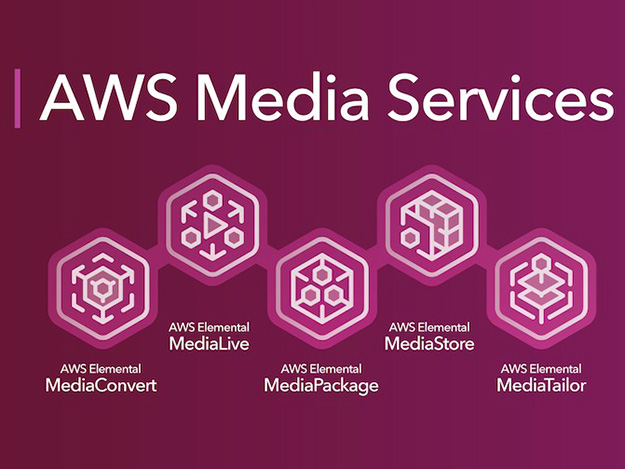
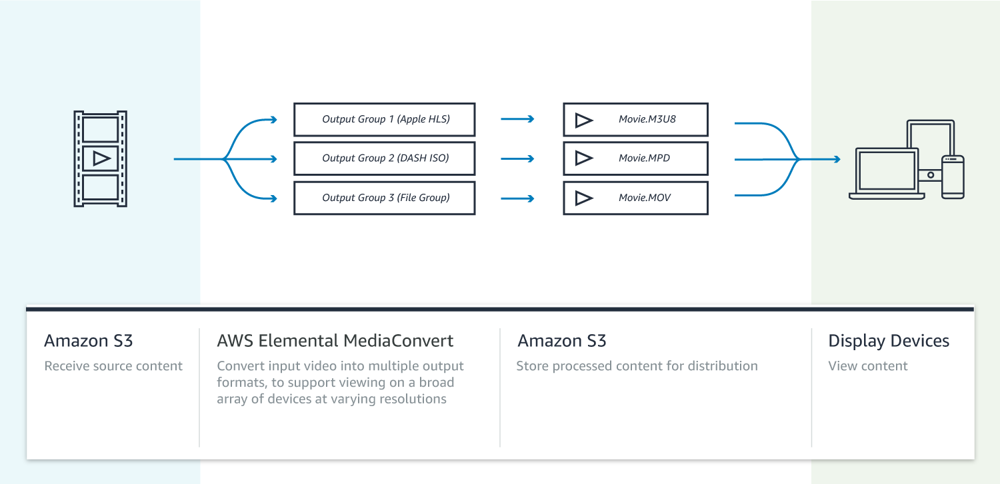
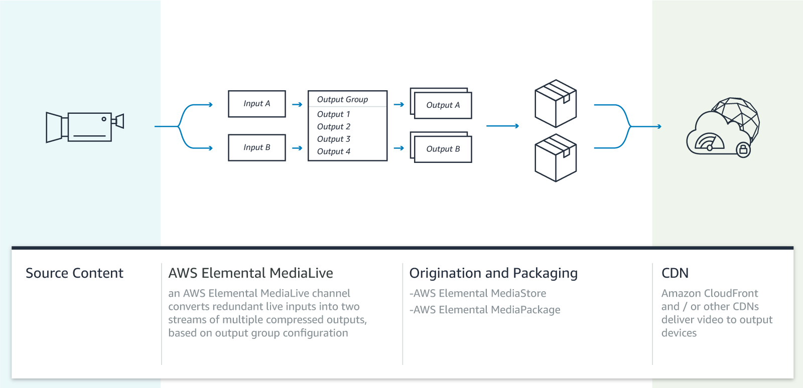
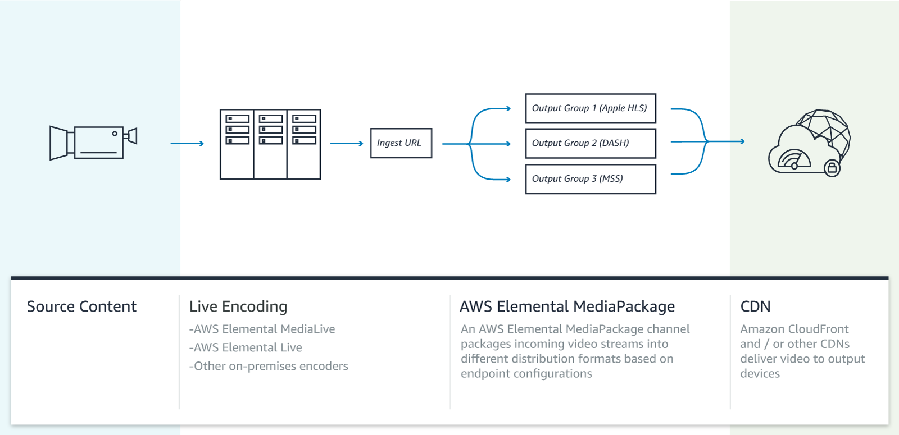
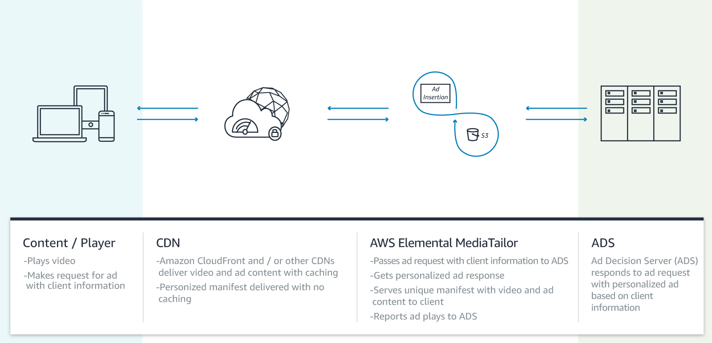

autoscale: true
slidenumbers: true
theme: Plain Jane, 3

## AWS Media Services でつくる
## ライブ動画配信システム
#### @mizmarine

---

# who are you?

- 泉 雅彦(@mizmarine)
- 広告業界４年目
  - Scala/Golang で 広告配信サーバ書いてる
- Like
  - :computer: Python / Scala
  - :runner: 脱出ゲーム
- 最近
  - 日曜プロジェクトで動画配信作ってる

---

# agenda

1. Introduction
1. 動画配信の基本用語
1. AWS Media Services とは
1. AWS Media Services で作る動画配信システム

---

# Introduction

### このトークの目的

---

# 動画配信 は手軽にできる！

---

# 動画配信サービスの隆盛

- 動画投稿/生配信
  - YouTube, ニコニコ動画, ..
- ビデオオンデマンド
  - Netflix, Hulu, Amazon prime video,...
- 個人配信
  - instagram ストーリー, facebook live, ...
- ライブコマース
  - メルカリチャンネル、SHOPROOM, ..

---

# 技術的に難しそう...

- 大量の専門用語
  - Live / VOD, HLS / MPEG2-DASH, RTP / RTMP, ...
- いわゆる WEBサービス開発とは異なる技術領域
  - api サーバでjson返そう、とは別のパラダイム
- ライブ配信ではリアルタイム性も問題に
  - ライブストリームのインフラ遅延からリアルタイムウェブまで

---

# AWS Media Services 発表

- re:Invent2017で発表された 動画関連の新しい５つのサービス
  - 2018.02 には東京リージョンでも利用可能に
- 組み合わせればフルマネージドでライブ配信できるサービスも

---

# おもしろそう！

---

# 触ってみた

- ちょっとした動画配信は **１時間もあれば作れた**
  - 動画配信の用語に馴染みがないと 勝手がわからないところもある
- 触ってみた経験を元に概要を解説
  - 併せて色々なハマりどころをご紹介
- AWS Media Services に興味を持つ人が増えると幸い

---

# 動画配信の基本用語

---

# ざっくり概念図

図

---

# 以下を押さえよう

これがわかれば AWS Media Services の雰囲気をつかめる

- Live / VOD
- HTTP Live Streaming
- Adaptive BitRate

---

# Live / VOD

動画コンテンツが「リアルタイムに」作られているものか、「過去」作られたものか、の配信形式の違い

- リアルタイムのものを Live配信
- 過去のもの（アーカイブ）を Video On Demand(VOD)配信

と呼ぶ

Live配信は入力されるストリームを常に変換しながら配信する必要がある
一方VOD配信はコンテンツが事前にわかっているが、コンテンツの持ち方を工夫しないとストレージがすぐにいっぱいに

---

# HTTP Live Streaming(HLS)

- 動画コンテンツをすべてDLしてから再生するのは時間がかかる
- 数秒毎に分割して少しずつダウンロードと再生を繰り返す
  - ストリーミング再生

---

# HLSの仕組み

- 短い動画（セグメント）と順番を記載した目次（プレイリスト）からなる
  - 動画プレイヤーはプレイリストを読み込み、パーツとして必要なセグメントを読み込む
- ライブ配信でも利用可能
  - リアルタイムにセグメントが増え続け、クライアントはそれを取得し続ける
- 参考
  - https://dev.classmethod.jp/tool/http-live-streaming/

---

# HLSの仕組み

図

---

# Adaptive BitRate(ABR)

- 通信環境に合わせて配信ビットレートを動的に変えること
  - 高速wifi環境: 4Mpbs
  - スマホキャリア回線: 600kbps など
- HLSはABR可能
  - ビットレート毎のプレイリストを用意
  - プレイリストのリストを返す

---

# ABR対応するために

- 各ビットレートでの動画コンテンツが必要となる
  - 事前に変換処理しておき、必要なものを使う
- ライブ配信では事前に全容を知れないがどうする？
  - オリジナルとなるストリームのセグメントを各ビットレートごとに変換して利用

- 参考
  - https://dev.classmethod.jp/cloud/aws/elastic-transcode-mpeg-dash-abr/

---

# 話した点を追加するとこう

図

---

# AWS Media Services?

---

---

# 5つのサービス

- AWS Elemental MediaConvert
- AWS Elemental MediaLive
- AWS Elemental MediaPackage
- AWS Elemental MediaStore
- AWS Elemental MediaTailor

---

# AWS Elemental MediaConvert

オンデマンドコンテンツ作成のための動画ファイル変換サービス

- 視聴環境に合わせた様々な動画コンテンツを用意できる
  - ABR対応のための複数bitrate
  - 配信デバイスに合わせた配信形式(HLS, MPEG-DASH, ..)
  - デジタル著作権管理 (DRM)処理やキャプション追加なども
- 変換してS3に出力するだけ

---

---

# AWS Elemental MediaLive

ライブ動画ストリーミングのリアルタイムエンコードサービス

- MediaConvertのライブ動画版
  - こちらも多様な形式で変換できる
- 出力先はS3だけでなくストリームとして扱う事ができる
  - S3に置く場合 MediaConvert同様VOD向けコンテンツ作成になる
  - ストリームをMediaPackageなどに渡すことで ライブ配信が可能
- AWS Media Services でライブ動画を扱う場合の「入り口」

---

---

# AWS Elemental MediaPackage

様々な配信デバイスにむけた動画コンテンツパッケージングサービス

- 単一ビデオ入力から配信面にあわせたストリームを提供
  - 配信形式ごとにendpointを作成
- 最大72時間のタイムシフト再生も可能
- 負荷に合わせて自動でスケール
- AWS Media Services でライブ動画を扱う場合の「出口」

---

---

# AWS Elemental MediaStore

メディア向けに最適化された AWSストレージサービス

- 低レイテンシーの読み取りと書き込みを可能とするストレージ
  - 「動画特化S3」
- ライブ動画のアーカイブとして利用できる
- AWS Media Services でライブ動画を扱う場合の「出口」

---

# AWS Elemental MediaTailor

ビデオストリームにターゲティング広告を配信できるサービス

- ServerSide Ad Insertion(SSAI) 対応
  - メインコンテンツと同じ配信系で広告挿入できる
    - bitrate変動やデバイスの影響うけにくい
    - アドブロック影響うけにくい
- メディアとしてはより収益化しやすくなる

---

---

# AWS Media Services でつくる動画配信サービス

---

- イメージ２通り
  - MediaLive * MediaPackage
  - MediaLive * MediaStore
  - 同時もできる

- 柔軟配信系
  - MediaLive * MediaPackage
    - MediaLiveの設定が鬼
    - outputgroups 数課金
    - channel ON の間課金
    - channel runningまで時間かかる -> hot standbyがよい
    - medialive のchannel上限
    - inputの設定で課金額変わる
- 動画アーカイブ配信系
  - MediaLive * MediaStore
    - outputgroups HLS設定
