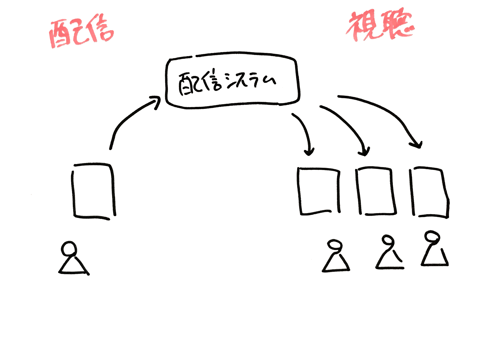

autoscale: true
slidenumbers: true
theme: Plain Jane, 3

# AWS Media Services でつくる
# ライブ動画配信システム

## みずまり@mizmarine

---

# who are you?


- みずまり(@mizmarine)
- 広告業界４年目
  - Scala/Golang で 広告配信サーバ書いてる
- Like
  - :computer: Python / Scala
  - :runner: 脱出ゲーム
- 最近
  - 日曜プロジェクトで動画配信作ってる

---

# agenda

1. Introduction
1. 動画配信の基本
1. AWS Media Services とは
1. AWS Media Services で作る動画配信システム

---

# 1.Introduction

### -伝えたいこと-

---

# ライブ動画配信は
# 手軽にできるようになった

---

# ライブ動画配信サービスの隆盛

- 動画投稿/生配信
  - YouTube, ニコニコ動画, ..
- 個人配信
  - instagram ストーリー, facebook live, ...
- ライブコマース
  - メルカリチャンネル、SHOPROOM, ..

---

# エンジニアとして
# 触ってみたいぞ

---

# 技術的に難しそう...

- 大量の専門用語
  - Live / VOD, HLS / MPEG2-DASH, RTP / RTMP, ...
- WEBサービス開発とは異なる技術領域
  - apiサーバが json返して〜とは別のパラダイム
- リアルタイム性も問題に
  - ライブストリームのインフラ遅延からリアルタイムウェブまで

---

# そんなとき現れたのが

---


---

# AWS Media Services

- 動画関連の新しい５つのサービス
  - 2017.11 re:Invent2017で発表
  - 2018.02 には東京リージョンでも利用可能に
- 組み合わせればライブ配信できるサービスも

---

# おもしろそう！

---

# 早速触ってみた

---

# 触ってみた感想

- ちょっとした動画配信は **１時間もあれば作れた**
  - 用語に馴染みがないと 勝手わからない部分も
- 触ってみた経験を元に概要を解説
  - 併せて色々なハマりどころをご紹介
- AWS Media Services おもしろいよ！

---

# 2.動画配信の基本

### -雰囲気をつかもう-

---

# 重要ワード

AWS Media Services の雰囲気をつかむために

- Live / Video On Demand
- HTTP Live Streaming
- Adaptive BitRate

---



---


---

# Live / Video On Demand(VOD)

- 配信コンテンツの性質
  - Live:「リアルタイム」に撮られているものを配信
  - VOD:「過去」に撮られたアーカイブを配信
- 終わりがわかっているかどうか、が大きな違い
  - アーカイブは事前に変換できる
  - ライブ配信中にそのアーカイブを後追い再生というややこしいケースも
- ライブストリームは RTP や RTMP というプロトコルで送受信される

^Live配信は入力されるストリームを常に変換しながら配信する必要がある
^一方VOD配信はコンテンツが事前にわかっているが、コンテンツの持ち方を工夫しないとストレージがすぐにいっぱいに

---


---

# HTTP Live Streaming(HLS)

- 動画コンテンツをすべてDLしてから再生するのは時間がかかる
- 数秒毎に分割、少しずつDLと再生を繰り返す
  - ストリーミング再生
- 最新コンテンツを少しずつ配信できるのでライブと相性◯
- HTTPプロトコル上でストリーミング再生を可能としたのがHLS

---

# HLSの仕組み

- 短い動画（セグメント）と順番を記載した目次（プレイリスト）からなる
  - 動画プレイヤーはプレイリストを読み込み、パーツとして必要なセグメントを読み込む
- ライブ配信でも利用可能
  - リアルタイムにセグメントが増え続け、クライアントはそれを取得し続ける
  - プレイリストでモードを指定できる
- 参考
  - https://dev.classmethod.jp/tool/http-live-streaming/

---


---

# Adaptive BitRate(ABR)

- 通信環境に合わせて配信ビットレートを動的に変えること
  - 高速wifi環境: 4Mpbs
  - スマホキャリア回線: 600kbps など
- HLSはABR可能
  - ビットレート毎のプレイリストを用意
  - プレイリストのリストを返す

---


---

# ABR対応するために

- 各ビットレートでの動画コンテンツが必要となる
  - 事前に変換処理しておき、必要なものを使う
- ライブ配信では事前に全容を知れないがどうする？
  - オリジナルとなるストリームのセグメントを各ビットレートごとに変換

- 参考
  - https://dev.classmethod.jp/cloud/aws/elastic-transcode-mpeg-dash-abr/

---


---

# これらをすべて自前で作るのは大変

- 動画の変換処理からホスティングまで気にする必要あり
  - よく利用されるのは Wowza Stream Engine あたり
  - 敷居が高い...
- そこに現れた AWS Media Services

---

# 3. AWS Media Services?

### -サービス概要紹介-

---


---

# 5つのサービス

名前でイメージできるものから用途よくわからないものまで

- AWS Elemental MediaConvert
- AWS Elemental MediaLive
- AWS Elemental MediaPackage
- AWS Elemental MediaStore
- AWS Elemental MediaTailor

---

# 5つのサービス

ライブ配信で重要となるのは以下

- ~~AWS Elemental MediaConvert~~
- **AWS Elemental MediaLive**
- **AWS Elemental MediaPackage**
- **AWS Elemental MediaStore**
- ~~AWS Elemental MediaTailor~~

---


# AWS Elemental MediaLive

ライブ動画ストリーミングのリアルタイムエンコードサービス

- 視聴環境に合わせた様々な動画コンテンツを用意できる
  - ABR対応のための複数bitrate
  - 配信デバイスに合わせた配信形式(HLS, MPEG-DASH, ..)
- 出力はストリームとして扱う事ができる
  - ストリームをMediaPackageなどに渡すことで ライブ配信が可能
  - S3に置く場合 MediaConvert同様VOD向けコンテンツ作成になる
- AWS Media Services でライブ動画を扱う場合の「入り口」

---


---


# AWS Elemental MediaPackage

様々な配信デバイスにむけた動画コンテンツパッケージングサービス

- 単一ビデオ入力から配信面にあわせたストリームを提供
  - 配信形式ごとにendpointを作成
- ライブ配信のオリジンとして利用可能
  - 最大72時間のタイムシフト再生も可能
- AWS Media Services でライブ動画を扱う場合の「出口」

---


---


# AWS Elemental MediaStore

メディア向けに最適化された AWSストレージサービス

- 低レイテンシーの読み取りと書き込みを可能とするストレージ
  - 「動画特化S3」
- ライブ動画のアーカイブとして利用できる
- ライブモードで出力すれば、こちらも配信動画のオリジンとして利用できる
- AWS Media Services でライブ動画を扱う場合の「出口」


---

## これら３つの組み合わせで
## ライブ配信のベースが作れますが
## 簡単に他２つも紹介します

---


# AWS Elemental MediaConvert

オンデマンドコンテンツ作成のための動画ファイル変換サービス

- MediaLiveのアーカイブ動画版
- 視聴環境に合わせた様々な動画コンテンツを用意できる
  - ABR対応のための複数bitrate
  - 配信デバイスに合わせた配信形式(HLS, MPEG-DASH, ..)
  - デジタル著作権管理 (DRM)処理やキャプション追加なども
- 変換してS3に出力するだけ

---


---


# AWS Elemental MediaTailor

ビデオストリームにターゲティング広告を配信できるサービス

- ServerSide Ad Insertion(SSAI) 対応
  - メインコンテンツと同じ配信系で広告挿入できる
    - bitrate変動やデバイスの影響うけにくい
    - アドブロック影響うけにくい
- メディアとしてはより収益化しやすくなる

---


---

# 4. AWS Media Services でつくる
# 動画配信サービス

### -触って出会った落とし穴たち-

---

# 構成パターン

大きくは以下

- MediaLive * MediaPackage
- MediaLive * MediaStore

同時に両方つなぐこともできる

---

# どう使い分けるか？

---

# MediaPackage vs MediaStore

- 複数デバイスの対応やDRM追加したかったら MediaPackage
- 3日以上の/明示的なアーカイブしたかったら MediaStore

設定簡単なのはMediaStore
配信デバイス固定であればこちらで良いと思う

公式FAQ
https://aws.amazon.com/jp/mediastore/features/

---

# Getting Started

具体的な方法は わかりやすいチュートリアル記事があるのでそちらを参照してください

20180123 20分でlive配信aws media services（media live mediapackage）_pub
https://www.slideshare.net/KamedaHarunobu/20180123-20liveaws-media-servicesmedia-live-mediapackagepub

【やってみた】AWS Elemental MediaLiveとAWS Elemental MediaPackageでライブ配信してみた
https://dev.classmethod.jp/cloud/aws/reinvent2017-awselemental-medialive-mediapackage-livestreaming/

【やってみた】AWS Elemental MediaLiveとAWS Elemental MediaStoreでライブ配信してみた
https://dev.classmethod.jp/cloud/aws/reinvent2017-awselemental-medialive-mediastore-livestreaming/

---

# MediaLive * MediaPackageの場合

配信先（MediaPackage）作ってから 入力（MediaLive）作っていきます

- MediaPackage channel
- MediaPackage endpoint
- MediaLive input
- MediaLive channel

---

# ここから
# チュートリアルを終えて
# 僕がハマった道を振り返ります

---

# チュートリアルはクリアした
# 概念は理解したぞ！

---

# でもリソース手動で作るの面倒

---

# API叩いて作れるようにしたいぞ!

---

# しかし

---

# 思ったより依存リソースが多い...

---

# 思ったより依存リソースが多い...

- UIから意識しづらい項目も多数
  - security group や アクセス権のparameter store など
  - それぞれをcreateできるroleも必要に
- リソース削除したい場合、事前に依存リソース削除する必要あり
  - ex. channel消してから -> input削除
  - channel削除に時間かかるので、state監視が必須

---

# 関連リソースは把握した！


---

# しかし

---

# MediaLive
# 設定項目数が半端ない...

---

# MediaLive設定項目数が半端ない...

動画、音声変換設定から 出力方法の設定まで大量にある

- 試しに見てみよう

```
aws medialive create-channel --generate-cli-skeleton
```

---


# MediaLive設定項目数が半端ない...


---


# MediaLive設定項目数が半端ない...


---

# **671**

---

# MediaLive設定項目数が半端ない...

- チュートリアルで作成した設定を確認、利用するのがお勧め

```
aws medialive describe-channel
```

- (ただし別の落とし穴も..（後述

---

# リソース作成処理できた！
# 事前に複数チャンネル並べてよう！

---

# しかし

---

# 途中からリソース作れなくなった...

---


# 途中からリソース作れなくなった...


---

# 途中からリソース作れなくなった...


- デフォルト medialive のchannel上限 = 5
- サポート投げて上限緩和しましょう

---

# 複数チャンネル並べられる！
# ライブしたいときにstartするだけ！

---

# しかし

---

# channel runningまで時間かかる...

---

# channel runningまで時間かかる


---


---

# channel runningまで時間かかる

- リソース作成(CREATING)に数分かかるのはわかる
- channel の開始(STARTING)にも数分かかる
  - 経験上、時間帯によってrunningまでに時間差がある
  - ライブしたい時間帯に併せて hot standby することに
  - アプリケーションレイヤでチャンネルID管理対応

---

# 複数channel
# hot standbyできた!

---

# MediaStore使って
# アーカイブもしてみたい

---

# MediaPacakgeと同じ感覚で
# MediaStoreに格納できた

---

# しかし

---

# ライブモードでしか利用できない...

---

# ライブモードでしか利用できない...

- ライブ終了しているはずなのに過去データを視聴できない
    - まっくら
    - 確かに今はライブしてないけど...

---
# ライブモードでしか利用できない...

- HLSにおいて ライブかアーカイブかは `EXT-X-PLAYLIST-TYPE` 項目で判断
  - `VOD` だと アーカイブモード
  - これがずっと `EVENT` のままだった


---

# ライブモードでしか利用できない...

- MediaLive設定の outputgroups HLS設定
  - モード指定「Live / VOD」 がある
- MediaLive channel stop 時に プレイリストファイルの 項目 が `EVENT` から VOD に書き換わるようになる
- 下手にCDN設定すると `EVENT` でキャッシュされてしまう
  - セグメントファイルは長時間キャッシュ持っても良い
  - プレイリストファイルはキャッシュ間隔短めに

---


---


---

# ライブ配信とアーカイブ
# できるようになった！

---

# しかし

---

# 料金が異常に高騰...

---

# 料金が異常に高騰...

- MediaLive料金体系
  - https://aws.amazon.com/jp/medialive/pricing/
- runningな間は **inputなくても配信中と同じ課金形態**
- Outputは **出力先１つごとに課金**
  - HLSのデフォルトテンプレート、出力先10コ使ってる
- input bitrateは 実際の使用量でなく 設定値を見て課金されている

---

# などなど様々な経験を経て
# 無事運用できるようになりました！

---

# まとめ

- AWS Media Services は フルマネージドな動画関連サービス
- インフラ周り気にすることがかなり減るのは大きなメリット
- ハマりどころも多いですが アプリケーションエンジニア一人で動画配信作れるのスゴイと思う
- 興味持った方は是非共に学んでいきましょう
